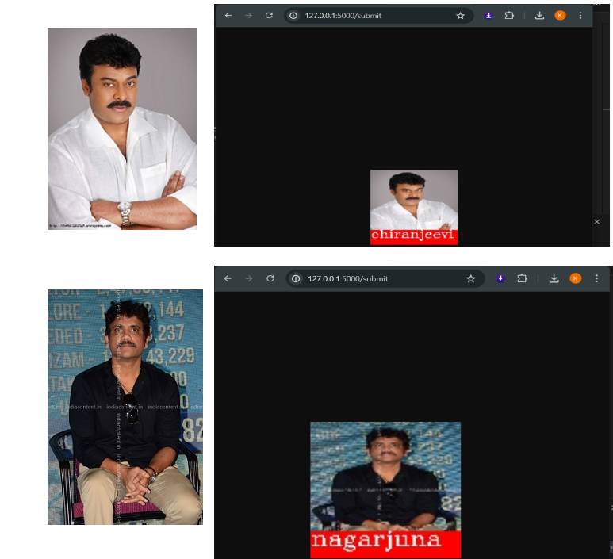

# Face Recognition Web App
- This project demonstrates a face recognition system trained to identify three famous Indian actors: Chiranjeevi, Rajinikanth,Nagarjuna. The project leverages several tools and technologies to create an 
   efficient and user-friendly web application.

#### Key Features
- Face Extraction: Utilizes the face_recognition library to extract faces from images.
- Model Training: Implements a Convolutional Neural Network (CNN) using TensorFlow to train the model on the extracted faces.
- Image Processing: Uses OpenCV for preprocessing and handling image data.
- Web Integration: Integrates the trained model into a web application using Flask for easy access and usability.
#### Tools and Technologies
- face_recognition: For extracting faces from images.
- TensorFlow: For building and training the CNN model.
- OpenCV: For image processing and handling.
- Flask: For creating a web interface to interact with the trained model.
#### How It Works
- Face Extraction: The face_recognition library is used to detect and extract faces from the provided images.
- Model Training: A CNN is trained using TensorFlow on a dataset consisting of face images of Chiranjeevi, Rajinikanth, and Nagarjuna.
- Image Processing: OpenCV is employed for preprocessing images, including resizing and normalization.
- Web Integration: The trained model is served through a Flask web application, allowing users to upload images and receive predictions on whether the faces in the images belong to any of the three actors.
Predictions
#### Here are some examples of how the model predicts images:

#### Limitations
- The current model can only recognize three actors: Chiranjeevi, Rajinikanth, and Nagarjuna.
- The accuracy of the model is dependent on the quality and quantity of the training dataset.
#### Future Work
- Expand the dataset to include more actors and increase the diversity of training images.
- Improve model accuracy by experimenting with different architectures and hyperparameters.
- Enhance the web interface for a better user experience.
